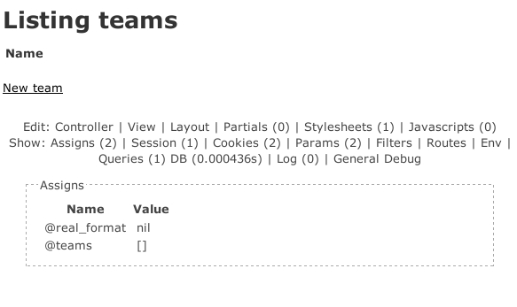

Title: Migrating Plugins to Rails 3
Author: Clinton R. Nixon
CSS: css/railsconf.css

---
Class: title

# Migrating Plugins to Rails 3

## Clinton R. Nixon, Viget Labs

---
## Projects used for examples

* Formtastic
* Typus
* `rails_console`

---
# Really easy stuff

---

## Rake tasks
{: .section-title}

---

`tasks/` has been deprecated. Rake tasks go in `lib/tasks/` now.

---

Rake tasks can also now be moved into a Railtie:

    module Typus
      class Railtie < ::Rails::Railtie
        rake_tasks do
          namespace :typus do
            desc "Install acts_as_list, acts_as_tree and paperclip."
            task :misc do
              # ...
            end
          end
        end
      end
    end

---
## Generators
{: .section-title}

--- 

### Big changes

* Rails 2: Rubigen
* Rails 3: Thor

---

### Rails::Generators::Base

Replicates in a lot of the Rubigen API.

---

### Rails 2 generator

    class FormtasticGenerator < Rails::Generator::Base
      def manifest
        record do |m|
          m.directory File.join('config', 'initializers')
          m.template 'formtastic.rb',   File.join('config', 'initializers', 'formtastic.rb')
          m.directory File.join('public', 'stylesheets')
          m.template 'formtastic.css',   File.join('public', 'stylesheets', 'formtastic.css')
          m.template 'formtastic_changes.css',   File.join('public', 'stylesheets', 'formtastic_changes.css')
        end
      end
    end

---

### Rails 3 generator

    require 'rails/generators'

    class FormtasticGenerator < Rails::Generators::Base
      def install_formtastic
        template File.join('config', 'initializers', 'formtastic.rb')
        template File.join('public', 'stylesheets', 'formtastic.css')
        template File.join('public', 'stylesheets', 'formtastic_changes.css')
      end
    end

---

### Rails 2 generator with name and options

    class FormGenerator < Rails::Generator::NamedBase
      default_options :haml => false,
                      :partial => false

      def initialize(runtime_args, runtime_options = {})
        base_name, @controller_class_path = extract_modules(@name.pluralize)
        # ...
      end

      def manifest
        record do |m|
          if options[:partial]
            # ...
          end
        end
      end
    end

---

### Rails 3 generator with name and options

    class FormGenerator < Rails::Generators::NamedBase
      class_option :haml, :type => :boolean, 
        :desc => 'Generate HAML instead of ERB.'
      class_option :partial, :type => :boolean, 
        :desc => 'Generate a form partial in the model views path, i.e. "_form.html.erb" or _form.html.haml".'
      class_option :controller, :type => :string, :banner => 'PATH', 
        :desc => 'Generate for custom controller/view path - in case model and controller namespace is different, i.e. "admin/posts".'

      def create_form 
        base_name, controller_class_path = extract_modules(name.pluralize)

        if options[:partial]
          # ... 
        end
      end
    end

---

Like tasks, generators have moved from `generators/` to `lib/generators/`.

---

## RAILS_*

All the `RAILS_*` constants are now deprecated. 

Move to using the `Rails` object:

  * `Rails.env`
  * `Rails.root`

---
# Plugging in to Rails 3

---

## The Rails 2 way

    ActionView::Base.send :include, Formtastic::SemanticFormHelper
    ActionView::Base.send :include, Formtastic::LayoutHelper

---

## The Rails 3 way

    ActiveSupport.on_load(:action_view) do
      include Formtastic::SemanticFormHelper
      include Formtastic::LayoutHelper
    end

Whatever callback you use, it gives you the context of `ActionWhatever::Base`.

--- 

## ActiveSupport hooks

* `before_configuration`
* `before_initialize`
* `before_eager_load`
* `after_initialize`
* All the base classes: `active_record`, `action_controller`, `action_view`, `action_mailer`, `i18n`

You can execute whatever code you need to inside these.

---

# The rest of it

Guesswork, blood, and hacks

---

## `rails_console`

Written by José Valim.

Touches all parts of Rails.

---

## My bright idea

I'd upgrade this plugin as a good example.

---

### Tears

---

## The first issue

      ~/Projects/railsconf_presentation/test3 [master] > rails server
      => Booting WEBrick
      => Rails 3.0.0.beta3 application starting in development on http://0.0.0.0:3000
      Exiting
      /home/cnixon/.rvm/gems/ruby-1.9.2-preview3/gems/activesupport-3.0.0.beta3/lib/active_support/core_ext/module/aliasing.rb:31:in `alias_method': undefined method `clean_backtrace' for class `Exception' (NameError)

---

## An example of using ActiveSupport hooks

In the plugin `rails_footnotes`:

    module Footnotes::Extensions::Exception
      def self.included(base)
        base.class_eval do
          alias_method_chain :clean_backtrace, :links
        end
      end
      # ... 
      def clean_backtrace_with_links
        # ...
      end
    end

    Exception.send :include, Footnotes::Extensions::Exception

A problem: Exception doesn't have a `clean_backtrace` method in Rails 3.

---

## The solution

